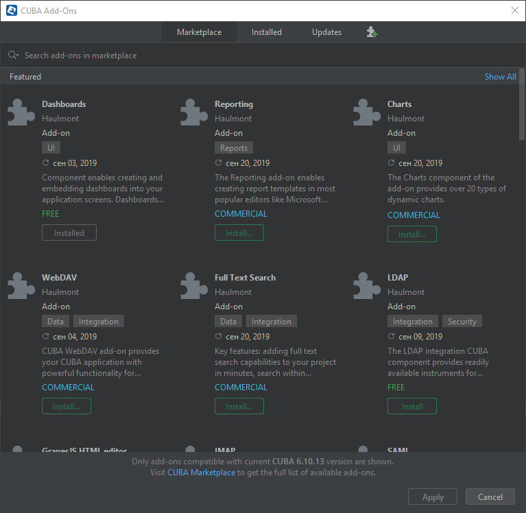

## QueryDSL Add-on

### Overview

The add-on provides [QueryDSL](http://www.querydsl.com/) integration for CUBA applications. [QueryDSL](http://www.querydsl.com/) enables the construction of unified type-safe database queries for Java. Instead of writing queries, you can use a fluent API.

See the [demo project](https://github.com/ikuchmin/querydsl-shop), using this add-on.

#### Suggestions in IDE

QueryDSL provides suggestions in your IDE while writing queries in your CUBA application.


#### Compilation

QueryDSL guarantees that the compiler will check that your database queries are type-safe. It also helps you adopt better to refactoring changes.


### Installation

The add-on can be added to your project in one of the ways described below. Installation from the Marketplace is the simplest way. The last version of the add-on compatible with the used version of the platform will be installed.
Also, you can install the add-on by coordinates choosing the required version of the add-on from the table.

In case you want to install the add-on by manual editing or by building from sources see the complete add-ons installation guide in [CUBA Platform documentation](https://doc.cuba-platform.com/manual-latest/manual.html#app_components_usage).

#### From the Marketplace

1. Open your application in CUBA Studio. Check the latest version of CUBA Studio on the [CUBA Platform site](https://www.cuba-platform.com/download/previous-studio/).
2. Go to *CUBA -> Marketplace* in the main menu.

 

3. Find the *QueryDSL* add-on there.

 

4. Click *Install* and apply the changes. The add-on corresponding to the used platform version will be installed.

#### By Сoordinates

1. Open your application in CUBA Studio. Check the latest version of CUBA Studio on the [CUBA Platform site](https://www.cuba-platform.com/download/previous-studio/).

2. Go to *CUBA -> Marketplace* in the main menu.

3. Click the icon in the upper-right corner.

 

4. Paste the add-on coordinates in the corresponding field as follows:

 `ru.udya.querydsl.cuba:querydsl-cuba-global:<add-on version>`

 where `<add-on version>` is compatible with the used version of the CUBA platform.

 | Platform Version | Component Version |
|-------------------|-------------------|
| 7.2.X             | 1.0.0             |

5. Click *Install* and apply the changes. The add-on will be installed to your project.

### Configuration

After adding the add-on in your application, you need to configure it:

1. Configure `global` module in the `build.gradle` file of your project.

 ```groovy
configure(globalModule) {
    dependencies {
    
        // begin: generated by CUBA Studio
        if (!JavaVersion.current().isJava8()) {
            runtime('javax.xml.bind:jaxb-api:2.3.1')
            runtime('org.glassfish.jaxb:jaxb-runtime:2.3.1')
        }
        // end: generated by CUBA Studio

        // begin: add by yourself
        compile group: 'com.querydsl', name: 'querydsl-jpa', version: '4.1.4'

        annotationProcessor group: 'com.querydsl', name: 'querydsl-apt', version: '4.1.4', classifier: 'jpa'
        annotationProcessor configurations.compile
        // end: add by yourself
    }
} 
```

2. Assemble the project. This part is needed to generate QueryDSL classes.

Now you can use type-safe queries in your application.

### Example

The [Demo project](https://github.com/ikuchmin/querydsl-shop) demonstrates the usage of the add-on.

Here is an example from the demo project:

```java
CubaQueryFactory queryFactory = new CubaQueryFactory(txDm, metadata);

QOrder order = new QOrder("o");
QOrderStorageItem orderStorageItem = QOrderStorageItem.orderStorageItem;

return queryFactory.select(order)
        .from(orderStorageItem).join(orderStorageItem.order, order)
        .where(orderStorageItem.storage.id.eq(storageId.getValue()))
        .orderBy(order.updateTs.desc())
        .fetch(view);
```
